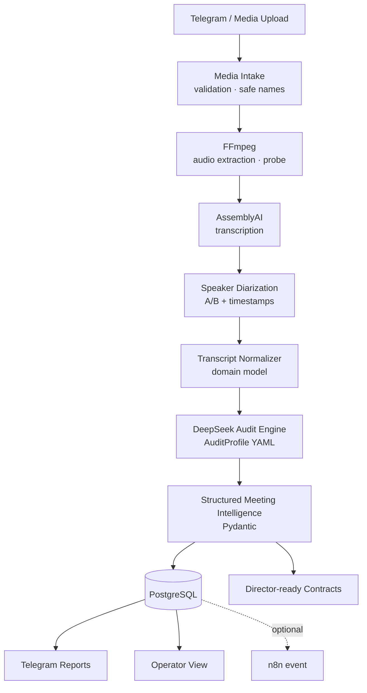
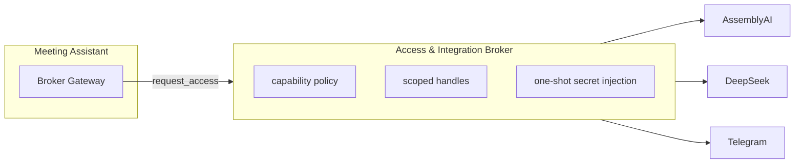

<div align="center">

# AI Meeting Intelligence & Audit Assistant

**AI-система для транскрибации, разделения спикеров, анализа деловых встреч
и автоматического извлечения решений, действий, рисков и обязательств.**

[](https://github.com/malexandro174-tech/ai-meeting-intelligence-audit-assistant/releases/tag/v1.1.0)
[](https://www.python.org/)
[](./docker-compose.yml)
[](https://www.postgresql.org/)
[](https://www.assemblyai.com/)
[](https://www.deepseek.com/)
[](https://core.telegram.org/bots/api)
[](#-проверка-качества)
[](./LICENSE)

🌐 **Public demo (Operator View):** <https://ai.mag-astro.ru/meeting-intelligence/>

</div>

---

> **Проблема.** После созвонов решения, обязательства, следующие действия и риски
> остаются в аудиозаписи или в чьих-то ручных заметках — и теряются.
>
> **Решение.** Отправьте запись встречи боту — система сама проведёт её через
> полный конвейер и вернёт структурированный отчёт с доказательствами.

```text
Audio / Video → Transcript → Speaker Diarization → AI Analysis
→ Structured Meeting Intelligence → Actions / Decisions / Risks
→ PostgreSQL → Telegram / Operator View
```

## Содержание

[О проекте](#-о-проекте) · [Возможности](#-возможности) · [Архитектура](#-архитектура) ·
[Пример результата](#-пример-результата-live-acceptance) · [Демонстрация](#-демонстрация) ·
[Сценарии использования](#-сценарии-использования) · [Интеграции](#-интеграции) ·
[Проверка качества](#-проверка-качества) · [Безопасность](#-безопасность) ·
[Быстрый запуск](#-быстрый-запуск) · [Roadmap](#-roadmap)

---

## 🧭 О проекте

AI Meeting Intelligence & Audit Assistant превращает запись любой встречи в
управляемый артефакт: транскрипт с разделением участников (Speaker A/B с
таймкодами), аудит по настраиваемому профилю, извлечение действий, решений,
обязательств, открытых вопросов и рисков — с обязательной цитатой-доказательством
для каждого вывода. Всё состояние живёт в PostgreSQL; результаты доставляются
в Telegram и в веб-операторскую сводку.

Ключевые инженерные решения:

- **Broker-first**: все внешние сервисы доступны только через Access & Integration
  Broker — приложение получает scoped handle и capability, но никогда не raw API-ключ;
- **Evidence-first**: вывод без подтверждения в транскрипте схлопывается в
  `NOT_DISCLOSED / NOT_SPECIFIED / UNKNOWN` — модель не выдумывает факты;
- **Prompt-injection-изоляция**: транскрипт передаётся модели только как данные
  между маркерами, попытки «игнорировать инструкции» внутри записи не меняют поведение;
- **Отказоустойчивость**: идемпотентность по content hash, bounded retry,
  resume после рестарта без повторной загрузки аудио.

## ⚙️ Возможности

### Speech Intelligence
- приём **MP3 / WAV / M4A / MP4** (регистр расширения не важен: `.mp3`, `.MP3`, `.Mp3`);
- извлечение аудиодорожки из видео (FFmpeg), нормализация под speech-профиль;
- транскрибация с таймкодами;
- **speaker diarization**: реплики Speaker A / Speaker B с миллисекундными границами;
- проверка содержимого: magic bytes + фактический контейнер + ffprobe-декодирование
  (файл с ложным `.MP3` и текстовым содержимым будет отклонён).

### Meeting Intelligence
- краткое резюме встречи;
- **action items** (владелец, срок, уверенность, реплика-источник);
- **decisions** и **commitments** (обсуждение отделяется от принятых решений);
- **open questions** и **risks** (категория, severity, рекомендация);
- рекомендации и общий статус 🟢/🟡/🔴.

### Commercial Meeting Audit
Настраиваемый профиль `commercial_meeting_v1` — 15 критериев: цель встречи,
контекст клиента, потребность, текущий процесс, желаемый результат, ограничения,
системы, интеграции, бюджет, сроки, ЛПР, риски, следующий шаг, ответственный,
согласованное действие. Профиль — YAML вне кода; критерии меняются без деплоя.

### Reliability
- идемпотентность: повторная загрузка того же файла не анализирует его заново;
- bounded retry + backoff, типизированные ошибки (`AUTH_FAILED`, `RATE_LIMITED`, …);
- **resume после рестарта**: незавершённые встречи продолжаются без повторного
  обращения к AssemblyAI; готовые результаты досылаются в Telegram автоматически.

### Security
- Broker-only интеграции, raw-секреты недоступны приложению;
- изолированная PostgreSQL во внутренней Docker-сети (порта наружу нет);
- безопасные имена файлов, защита от path traversal, валидация содержимого;
- логи без секретов и полных транскриптов.

## 🏗 Архитектура





Внешние вызовы выполняются только через Broker: он проверяет capability,
выдаёт scoped handle и сам доставляет секрет в одноразовый дочерний процесс.
Приложение ни в одной точке не получает raw credential.

## 📊 Пример результата (live acceptance)

Реальный коммерческий диалог, обработанный системой end-to-end:

| Метрика | Значение |
|---|---|
| Спикеров | **2** (Speaker A / B) |
| Реплик | **24** |
| Профиль аудита | `commercial_meeting_v1` |
| Итоговый статус | 🟢 GREEN |

**Краткое резюме:** клиент обсуждает автоматизацию обработки заявок и
интеграцию каналов привлечения.

**Actions:** предоставить тестовые доступы · подготовить примеры заявок ·
подготовить техническую схему · провести согласование.

**Risks:** стабильность интеграции с внешним каналом заявок · дублирование
клиентов из разных каналов.

**Open question:** подключать ли дополнительный мессенджер на первом этапе?

*(Пример обезличен; реальные записи и транскрипты не публикуются.)*

## 🖥 Демонстрация

- **Telegram:** бот принимает аудио/видео встречи, ведёт статусы
  («Файл получен» → … → готовый итог с действиями и рисками);
  длинные сообщения разбиваются без повреждения блоков;
- **Operator View (public demo):** <https://ai.mag-astro.ru/meeting-intelligence/> —
  обработанные встречи, состояние, длительность, число спикеров, количество
  действий и рисков; тёмная тема (navy / graphite / burgundy);
- артефакты каждой встречи: `transcript.md`, `meeting_report.md`, `meeting_report.json`.

<details>
<summary>📷 Скриншоты — как добавить (владельцу)</summary>

Скриншоты не публикуются автоматически, чтобы исключить попадание приватных
данных. Владелец может добавить в `docs/images/`:
`telegram-meeting-audit.png` (TEST-чат: отправленный файл + готовый аудит) и
`operator-view.png` (operator view). README остаётся полностью рабочим и без них.
</details>

## 🎯 Сценарии использования

| Сценарий | Что даёт система |
|---|---|
| Коммерческие переговоры | аудит по 15 критериям, обязательства, следующий шаг |
| Встречи с клиентами | резюме, открытые вопросы, риски, история в БД |
| Внутренние совещания | решения и действия с владельцами |
| Проектные планёрки | commitments и действия с таймкодами-доказательствами |
| Интервью | структура диалога по спикерам, извлечение договорённостей |
| Обучение сотрудников | разбор записей тренингов, контроль договорённостей |
| Customer support / call analysis | категории рисков, эскалации, метрики качества |

## 🧩 Готовность к multi-agent архитектуре

Система проектировалась не как одноразовый бот, а как будущий **AI Employee**
«Meeting Intelligence & Audit Employee». Реализованы стабильные контракты
(`contracts/meeting_contracts.schema.json`):

- `MeetingUpwardReport` — сводка вверх по иерархии;
- `KpiSnapshot` — метрики (успешность транскрибации/анализа, открытые действия, критические риски);
- `MeetingEscalation` — эскалация с severity и доказательством;
- `CommercialSummary` — сводка для коммерческого директора;
- Finance/Engineering события (`BUDGET_MENTIONED`, `TECHNICAL_BLOCKER`, …).

Будущие потребители: Commercial Director, Financial Director, Engineering
Director, HR/Training. Подключение реального Directors Framework —
**подготовлено к интеграции** (сами директора сейчас не подключены).

## 🔌 Интеграции

| Сервис | Роль | Статус |
|---|---|---|
| AssemblyAI | транскрибация + диаризация | ✅ READY |
| DeepSeek | анализ встречи по профилю | ✅ READY |
| Telegram | приём медиа + отчёты | ✅ READY |
| PostgreSQL | персистентность | ✅ READY |
| n8n | optional automation event | ⚪ OPTIONAL (non-blocking) |
| NocoDB | optional read integration | ⚪ OPTIONAL (read-only по политике) |

## 🛠 Технологический стек

| Component | Role |
|---|---|
| Python 3.12 + Pydantic v2 | runtime, доменные модели, валидация LLM-вывода |
| Telegram Bot API | интерфейс приёма и доставки |
| AssemblyAI | speech-to-text, speaker diarization |
| DeepSeek | audit engine |
| FFmpeg | извлечение аудио, нормализация, probe |
| PostgreSQL 16 + psycopg 3 | хранение |
| Docker / Docker Compose | деплой с лимитами памяти и healthchecks |
| Nginx | reverse-proxy subpath для Operator View |
| Access & Integration Broker | политика доступа и доставка секретов |

## ✅ Проверка качества

Реально подтверждённые проверки (числа — из последнего прогона тест-раннера):

- **Unit/integration suite: 19 passed** (`python -m pytest tests/ -q`)
  — валидация медиа (MP3/WAV/M4A/MP4, регистр расширений), magic-bytes,
  нормализация транскрипта, чанкинг сообщений, evidence-guard
  (анти-галлюцинации), prompt-injection-изоляция, идемпотентность, retry,
  resume-after-restart, персистентность PostgreSQL;
- **Live acceptance:** реальный двухголосный диалог → 2 спикера, 24 реплики,
  аудит GREEN, артефакты, доставка в Telegram;
- **Restart test:** рестарт контейнеров с сохранением истории и без повторной обработки;
- **Secret scan / PII scan / media scan** перед каждым публичным обновлением.

## 🔐 Безопасность

- секреты исключены из Git (`.env` игнорируется; ключи доставляются только
  средой в одноразовые процессы);
- Broker-only credentials: приложение не видит raw API-ключи и токены;
- валидация входных файлов: тип, размер, сигнатуры, декодируемость, длительность;
- изолированная PostgreSQL во внутренней Docker-сети, публичного порта БД нет;
- транскрипт рассматривается как **untrusted data**: prompt-injection-изоляция,
  выводы без доказательств отбрасываются;
- приватность: реальные записи и транскрипты никогда не публикуются.

## 🚀 Быстрый запуск

Standalone-деплой (без private-инфраструктуры владельца):

```bash
git clone https://github.com/malexandro174-tech/ai-meeting-intelligence-audit-assistant.git
cd ai-meeting-intelligence-audit-assistant
cp .env.example .env      # заполните свои ключи AssemblyAI/DeepSeek/Telegram
docker compose up -d --build
```

Продакшн-деплой владельца дополнительно использует Access & Integration Broker:
приложение запускается с `BROKER_TRANSPORT=container_env`, а scoped-переменные
доставляются в контейнер каноническим путём (`docker-compose.prod.yml`).
Внутренние адреса, пароли и приватный Broker registry в репозиторий не входят.

### Структура проекта

```text
app/
  broker/       # Broker Gateway: local Mag_OS и container_env транспорты
  core/         # security (safe names), events (observability)
  media/        # валидация + FFmpeg-извлечение аудио
  meetings/     # pipeline, модели, analyzer, storage, reports, director-контракты
  telegramui/   # бот, чанкинг, транспорт
  operatorview.py  # веб-сводка оператора
profiles/       # AuditProfile YAML (commercial_meeting_v1)
contracts/      # JSON-схемы Director-контрактов
tests/          # unit + pipeline интеграционные
fixtures/       # генератор синтетических демо-медиа
docs/           # архитектурная документация
```

## 🧭 Ограничения

- качество diarization зависит от качества записи (на синтетических голосах
  одного движка провайдер может сливать спикеров; на живых диалогах не воспроизводится);
- число спикеров иногда требует контекста встречи (подсказка `speakers_expected`
  передаётся только как опция конкретного запуска);
- длинные записи увеличивают время обработки;
- внешние провайдеры требуют доступности их API;
- n8n / NocoDB — optional-интеграции, ядро от них не зависит.

## 🗺 Roadmap

- настраиваемые профили аудита под типы встреч;
- веб-загрузка медиа (сверх лимита Telegram);
- поиск по встречам и transcript search;
- трекинг action items (статусы, просрочки);
- speaker identification по именам участников;
- director dashboards и multi-meeting analytics;
- n8n workflow templates.

---

<div align="center">

**Public demo:** <https://ai.mag-astro.ru/meeting-intelligence/> ·
**Releases:** [v1.1.0](https://github.com/malexandro174-tech/ai-meeting-intelligence-audit-assistant/releases/tag/v1.1.0)

Технические названия (README, API, Broker, Docker, PostgreSQL, AssemblyAI, DeepSeek) —
без искусственного перевода; описания — на русском.

</div>
